# Data Model

## Entity Relationship Diagram

```mermaid
erDiagram
    games ||--o{ targets : "has many"
    targets ||--o{ targetSlots : "has many"
    targets ||--o{ packs : "has many"
    targetSlots ||--o{ mods : "has many"
    games ||--o{ packs : "has many"

    users ||--o{ accounts : "signs in with"
    users ||--o{ sessions : "holds"
    users |o--o{ deviceCodes : "confirms"
    users ||--o{ packs : "uploads"
    users ||--o{ collections : "curates"
    users ||--o{ votes : "votes"
    users ||--o{ favorites : "favorites"
    users |o--o{ downloads : "makes"
    users ||--o{ comments : "writes"
    users ||--o{ reports : "files"

    packs ||--o{ mods : "groups"
    packs ||--o{ packImages : "has many"
    packs ||--o{ packTags : "tagged with"
    packs ||--o{ votes : "receives"
    packs ||--o{ favorites : "receives"
    packs ||--o{ downloads : "tracked"
    packs ||--o{ comments : "receives"
    tags ||--o{ packTags : "applied to"

    collections ||--o{ collectionItems : "contains"
    packs ||--o{ collectionItems : "included in"

    users ||--o{ codeMods : "publishes"
    games ||--o{ codeMods : "has many"
    codeMods ||--o{ codeModReleases : "versions"
    codeModReleases ||--o{ codeModBuilds : "built as"
    codeModLayouts ||--o{ codeModBuilds : "targeted by"
    codeModReleases ||--o{ codeModReleaseDependencies : "depends on"

    users {
        text id PK
        text name UK
        text email UK
        bool emailVerified
        text image
        text role "user | moderator | admin"
        bool banned
        text banReason
        int banExpires "timestamp_ms, nullable"
        text bio
        text pronouns
        bool showDiscord
        bool showTwitter
        bool showGithub
        text twitterHandle
        text githubUsername
        text websiteUrl
        bool onboardingCompleted
        text source "null, ssbmtextures, or preview-sync"
        int createdAt
        int updatedAt
    }

    accounts {
        text id PK
        text userId FK
        text accountId
        text providerId "unique with accountId"
        text accessToken
        text refreshToken
        int accessTokenExpiresAt
        int refreshTokenExpiresAt
        text scope
        text idToken
        text password
        int createdAt
        int updatedAt
    }

    sessions {
        text id PK
        text userId FK
        text token UK
        int expiresAt
        text ipAddress
        text userAgent
        int createdAt
        int updatedAt
    }

    verifications {
        text id PK
        text identifier
        text value
        int expiresAt
        int createdAt
        int updatedAt
    }

    deviceCodes {
        text id PK
        text deviceCode UK
        text userCode
        text userId FK
        int expiresAt
        text status
        int lastPolledAt
        int pollingInterval
        text clientId
        text scope
    }

    games {
        text id PK
        text name
        text slug UK
        text shortName
        text platform
        text iconKey
        text bannerKey
        json config
        int createdAt
        int updatedAt
    }

    targets {
        text id PK
        text gameId FK
        text name
        text slug
        text category "character | stage | ui | audio"
        text iconKey
        text modelKey
        text nativeHsdAnimationKey "unused; always null"
        text fileCode "Melee character code, e.g. Fx; null for non-characters"
        int sortOrder
    }

    targetSlots {
        text id PK
        text targetId FK
        text name "e.g. Neutral, Red, Blue, Green"
        text fileCode "Melee costume code, e.g. La in PlFxLa.dat; null if no file"
        int sortOrder
    }

    packs {
        text id PK
        text userId FK
        text gameId FK
        text targetId FK
        text title
        text slug
        text description
        text thumbnailKey
        text status "processing | pending | approved | rejected | corrupted"
        int expectedModCount
        text imageProcessingStatus "pending | processing | succeeded | failed | skipped"
        text imageProcessingError
        int downloadCount
        text source "null or ssbmtextures"
        text sourceId
        int createdAt
        int updatedAt
        int publishedAt "nullable"
        int deletedAt "nullable, soft delete"
    }

    mods {
        text id PK
        text packId FK
        text slotId FK
        text fileKey "R2 storage key"
        text fileName "original filename for downloads"
        text label "optional display label"
        text processingStatus "queued | processing | succeeded | failed"
        text processingError
        int processedAt
        int createdAt
    }

    packImages {
        text id PK
        text packId FK
        text imageKey
        int sortOrder
    }

    tags {
        text id PK
        text name UK
        text slug UK
    }

    packTags {
        text packId FK
        text tagId FK
    }

    collections {
        text id PK
        text userId FK
        text title
        text slug
        text description
        text thumbnailKey
        int createdAt
        int updatedAt
    }

    collectionItems {
        text id PK
        text collectionId FK
        text packId FK
        int sortOrder
        int addedAt
    }

    votes {
        text userId FK
        text packId FK
        text source "nullable"
        int createdAt
    }

    favorites {
        text userId FK
        text packId FK
        int createdAt
    }

    downloads {
        text id PK
        text packId FK
        text userId FK "nullable"
        int downloadedAt
    }

    comments {
        text id PK
        text packId FK
        text userId FK
        text parentId "nullable, for replies"
        text body
        text source "nullable"
        int createdAt
        int updatedAt
    }

    reports {
        text id PK
        text reporterId FK
        text targetType "pack | comment"
        text targetId "polymorphic"
        text reason "inappropriate | stolen | spam | broken | other"
        text details "nullable free-text"
        text status "pending | resolved | dismissed"
        text resolvedBy FK "nullable"
        int resolvedAt "nullable"
        int createdAt
    }

    codeMods {
        text id PK "Artifacts repo mod-<id>"
        text userId FK
        text gameId FK
        text slug UK "manifest id"
        text name
        text description
        text sourceKind "github | push"
        text sourceUrl "nullable"
        int downloadCount
        int createdAt
        int updatedAt
        int deletedAt "nullable, soft delete"
    }

    codeModReleases {
        text id PK
        text codeModId FK
        text version "unique with codeModId"
        text tag
        text commitSha
        text license
        text status "processing | pending | approved | rejected | failed"
        text error "why a failed release failed"
        text reviewedBy FK "nullable"
        int reviewedAt "nullable"
        int createdAt
        int updatedAt
        int publishedAt "nullable"
    }

    codeModLayouts {
        text id PK "16 hex digits"
        text api "tgg-melee/0"
        text port
        text target "target triple, e.g. x86_64-linux-gnu"
        text portVersion "tgg-melee release"
        bool active
        int createdAt
    }

    codeModReleaseDependencies {
        text releaseId PK,FK
        text dependency PK "a codeMods slug"
        text range "version range"
    }

    codeModBuilds {
        text id PK
        text releaseId FK
        text layoutId FK "unique with releaseId"
        text status "queued | building | succeeded | failed"
        text runId "CI Workflow instance"
        text image
        text packageKey "R2 key"
        text packageSha256
        int packageSize
        json manifest "packed manifest"
        json canonicalHooks "before, after, replaces; canonical names"
        text netplay "code | files | costumes | data; null before it builds"
        text logKey "compiler log in R2"
        text signature
        text error
        int createdAt
        int finishedAt "nullable"
    }
```



## Relationship Notes

All foreign keys use `ON DELETE CASCADE` except `reports.resolvedBy`
(`ON DELETE SET NULL`) and `downloads.userId` (no cascade — nullable, no
constraint action). `comments.parentId` references `comments.id`, so deleting a
comment deletes its replies.

`users`, `accounts`, `sessions`, `verifications`, and `deviceCodes` are the
better-auth tables. `verifications` has no foreign key; it holds
email-verification and password-reset tokens keyed by `identifier`.
`deviceCodes` holds `tgg login` sign-ins in progress: `pending` until the user
who looked the code up on `/device` approves or denies it, then removed when
the command line collects its session (or finds the code expired). A command
line's session is an ordinary `sessions` row with user agent `tgg/<version>`.

No API route, queue job, or page reads or writes `collections`,
`collectionItems`, or `favorites`. The tables exist in the schema, and
`packages/preview-sync` copies `collections` and `collectionItems` and clears
`favorites` during a preview refresh. A "like" on the site is a row in `votes`.

`users.source` is null for an account created on the site, `"ssbmtextures"`
for an imported one, and `"preview-sync"` for the sanitized copy of a
production user that a preview refresh writes to the preview database. The
refresh also deletes every row of `reports` there.

Three tables sit outside the Drizzle schema. Wrangler records applied migrations
in `d1_migrations`. `packages/preview-sync` creates `_preview_sync_lock` in the
preview database so only one refresh runs at a time, and refuses to run unless
the preview database has `_preview_marker`, a table created by hand in preview
only.

### Soft Deletes

Only `packs` has a `deletedAt` column. Soft-deleted packs are excluded from
public queries with `isNull(packs.deletedAt)`. A pack's R2 objects all live under
`packs/<id>/`; `deletePackObjects` in `packages/db` deletes that prefix when a
pack is rejected, soft-deleted, or purged with its owner. The queue Worker's
hourly sweep soft-deletes a pack still `corrupted` 30 days after it last
changed, deleting its objects first. Hard deletes (admin ban-purge,
and the cleanup of an upload that fails before it is queued) cascade to mods,
votes, favorites, downloads, packTags, packImages, collectionItems, and
comments. Comments are hard-deleted, and their replies with them. Reports are
resolved or dismissed; no route deletes them. A hard delete dismisses, in the
same batch, every pending report whose pack or comment is gone, leaving
`resolvedBy` null. Neither table has a `deletedAt`.

### Upload Lifecycle

The upload form's saved draft and in-flight upload progress live in the
browser only — they are not database statuses. The DB lifecycle for a pack is:

```
processing -> pending -> approved | rejected
processing -> corrupted -> processing (retry)
corrupted -> pending (a timed-out job completes)
```

`transitionPack` in `packages/db` is the only writer of `status` after the
upload inserts the pack. It moves a pack that is not deleted from a given set
of statuses in one guarded `UPDATE`, so concurrent moderators or jobs cannot
both win a transition.

- `processing` — mod DAT validation and/or image optimization is in progress.
- `pending` — all mods and image jobs reached terminal success; awaiting
  moderator review. Only a `pending` pack can be approved or rejected.
- `approved` — published and publicly visible. `publishedAt` is set.
- `rejected` — moderator rejected. Not publicly visible.
- `corrupted` — processing failed: a mod failed DAT validation, the image job
  exhausted its queue retries, or the pack stayed in `processing` for 24 hours
  with no job completing, and the queue Worker's hourly sweep timed it out. A
  job the sweep timed out may still complete; once every job has succeeded,
  the pack moves to `pending` as if it had never timed out. The owner or a moderator
  can repair it: `POST /api/packs/by-id/:id/mods/:modId/retry` replaces a
  `failed` mod file, and `POST /api/packs/by-id/:id/images/retry` reruns a
  `failed` image job. Either returns the pack to `processing`. A pack nobody
  repairs for 30 days is deleted with its files.

An upload is bounded by `LIMITS` in `@vgskins/shared`: each DAT is at most
8 MB, each screenshot 10 MB, a pack's files 47 MB together, and the request
48 MB, which the API refuses with 413 before reading it.

A pack does not advance to `pending` until every required mod job and the
image processing job (if images were uploaded) have reached a terminal
success state. `expectedModCount` tracks how many mods the queue should
expect; `imageProcessingStatus` tracks the image job independently.

### `targets.nativeHsdAnimationKey`

Unused nullable column. The application neither reads nor writes it, and every
row holds null. Dropping it requires a contract migration.

### Reports

Reports are polymorphic: `targetType` is either `"pack"` or `"comment"`, and
`targetId` references the corresponding row. There is no foreign key constraint
on `targetId` because the target may be deleted before the report is resolved.
A user can have at most one pending report per target. Moderators resolve
(`"resolved"`) or dismiss (`"dismissed"`) reports; `resolvedBy` and
`resolvedAt` are set at that time.

### Code Mods

A code mod is a mod for tgg-melee, the Melee port with the mod runtime built in
(`tgg-melee/0`). It is separate from `packs` and `mods`, which hold texture
packs. Its `slug` is the manifest `id`, which also names the folder the mod
installs into, so it is unique across the registry. Its source lives in the
Cloudflare Artifacts repo `mod-<id>`.

A release is one tag on that repo. A compiled mod library loads only into a port
build with the same game layout id, so a release is built once per active row of
`codeModLayouts`, against that layout's game SDK in the builder image (one
tgg-melee release per layout). A new layout gets builds of existing releases
without a new review, since review covers the source at `commitSha`. A retired
layout (`active` false) gets no new builds, and its packages stay downloadable. Players fetch the builds for the
layout id their port executable reports.

`canonicalHooks` holds the manifest's hooks under canonical names: `name` for an
exported function and `file.c:name` for a static. The runtime treats both spellings
as one function, so conflict checks compare these.

A release's `codeModReleaseDependencies` are its manifest's `depends`: each mod
id with the version range it accepts. A release that depends on a mod the
registry doesn't have fails when it is recorded.

A build's `netplay` is what `tgg mod build` infers the package counts as for
netplay: `code` (a library) and `files` (a disc file that can affect play)
count, `costumes` counts unless the game finds its costumes change only looks,
and `data` (menu and trophy files, assets) is free. Manifests don't declare it;
a manifest with a `netplay` field fails its release. A release shows its
builds' class.

```
codeModReleases: processing -> pending -> approved | rejected
                 processing -> failed (no build succeeded)
                 failed from the start (a manifest the game would refuse, or a
                 dependency the registry doesn't have)
codeModBuilds:   queued -> building -> succeeded | failed
```

`transitionRelease` in `packages/db` is the only writer of a release's `status`
after the build pipeline inserts it, with the same guarded `UPDATE` as
`transitionPack`.

`packages/preview-sync` does not copy the code mod tables.

## SSBM Example

### Game Setup

```
game: Super Smash Bros. Melee (slug: "melee", platform: "GameCube")
  │
  ├── target: Fox (category: "character", slug: "fox", fileCode: "Fx")
  │     ├── slot: Neutral  (sortOrder: 0, fileCode: "Nr")  → PlFxNr.dat
  │     ├── slot: Orange   (sortOrder: 1, fileCode: "Or")  → PlFxOr.dat
  │     ├── slot: Blue     (sortOrder: 2, fileCode: "La")  → PlFxLa.dat
  │     └── slot: Green    (sortOrder: 3, fileCode: "Gr")  → PlFxGr.dat
  │
  ├── target: Falco (category: "character", slug: "falco", fileCode: "Fc")
  │     ├── slot: Neutral  (fileCode: "Nr")
  │     ├── slot: Red      (fileCode: "Re")
  │     ├── slot: Blue     (fileCode: "Bu")
  │     └── slot: Green    (fileCode: "Gr")
  │
  ├── target: Final Destination (category: "stage", slug: "final-destination")
  │     └── slot: Default  (sortOrder: 0)
  │
  └── ... (26 characters, 30 stages, and UI/audio targets with one Default slot)
```

Slot file codes come from the fighter costume tables in the doldecomp/melee
decompilation (`src/melee/ft/kinds/*`). Upload slot inference and the
legacy backfill (`pnpm --filter @vgskins/db legacy-backfill`) match
filenames against them with `parseCostumeFileName` from `@vgskins/shared`.

### Single-Mod Pack

User uploads one .dat file for one character + one color slot. Every upload
creates a pack; a single-file upload is a pack with one mod.

```
pack: "Goku Fox"
  game:   melee
  target: Fox
  slot:   Neutral
  mod:    file: packs/abc123/mods/def456/Goku.dat
  images: [packs/abc123/images/0, packs/abc123/images/1]
  tags:   [dragon-ball, anime]
```

### Multi-Mod Pack (1 target, multiple slots)

User uploads .dat files for all 4 Fox colors. Each file takes the slot its
Melee filename names (`PlFxOr.dat` is Orange); the uploader assigns any slot
the form cannot infer. A pack holds at most one mod per slot.

```
pack: "Goku Fox Complete"
  game:   melee
  target: Fox
  │
  ├── mod: "Goku Fox - Neutral"
  │     slot: Neutral, file: packs/def456/mods/m1/Goku.dat
  ├── mod: "Goku Fox - Orange"
  │     slot: Orange,  file: packs/def456/mods/m2/Goku.dat
  ├── mod: "Goku Fox - Blue"
  │     slot: Blue,    file: packs/def456/mods/m3/Goku.dat
  └── mod: "Goku Fox - Green"
        slot: Green,   file: packs/def456/mods/m4/Goku.dat
```

### Collection (cross-target/cross-creator curation)

The schema lets a user group packs into a themed collection. Collection items
always reference a pack (via `collectionItems.packId`). Nothing in the API or
the site creates or shows collections.

```
collection: "Dragon Ball Z Roster" (by user: goku_modder)
  │
  ├── item: pack "Goku Fox Complete"       (by: goku_modder)
  ├── item: pack "Vegeta Falco Complete"    (by: goku_modder)
  └── item: pack "Piccolo Link Complete"    (by: goku_modder)

collection: "Best Tournament Packs 2026" (by user: tournament_fan)
  │
  ├── item: pack "Clean Fox HD"      (by: texture_master)
  ├── item: pack "Neon Falco"        (by: goku_modder)
  └── item: pack "Minimal Marth"     (by: clean_mods)
```

### How It All Connects

```
Browse Flow:
  /games/melee                         → list all approved packs for Melee
  /games/melee?target=fox              → filter to Fox packs
  /games/melee?target=fox,falco        → filter to Fox and Falco packs
  /games/melee/packs/goku-fox-a1b2c3   → pack detail page (shows all mods/slots)

User Profile:
  /users/goku_modder                   → lists their uploaded packs
  /users/goku_modder?tab=likes         → lists the packs they voted for

Upload Flow:
  1. Drop .dat files and screenshots → target detected from the filenames, or picked
  2. One .dat per slot, inferred from each filename (every upload creates a pack)
  3. Title, description, tags, images shared across the pack
  4. Pack enters processing → pending → approved | rejected
```
